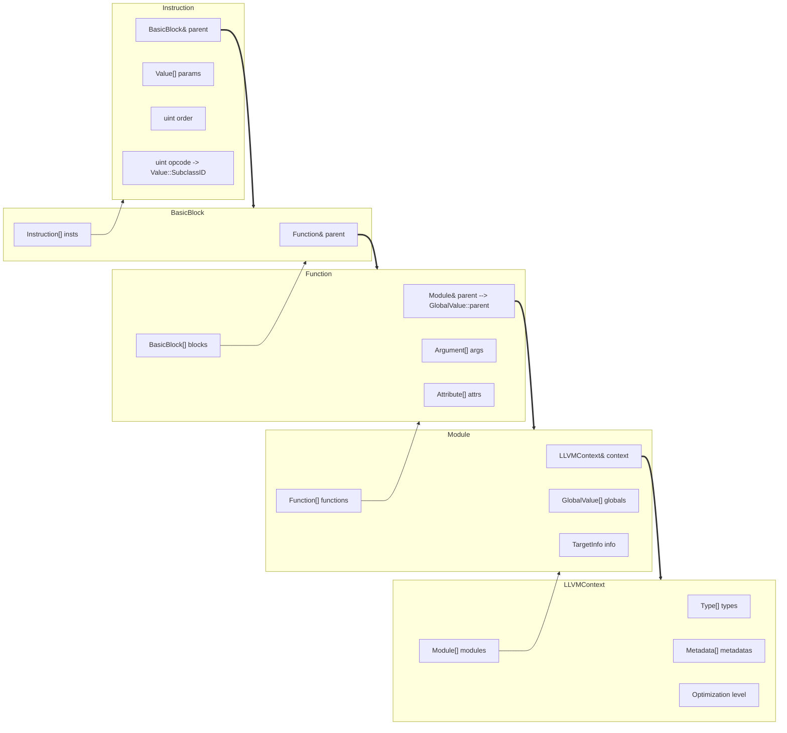
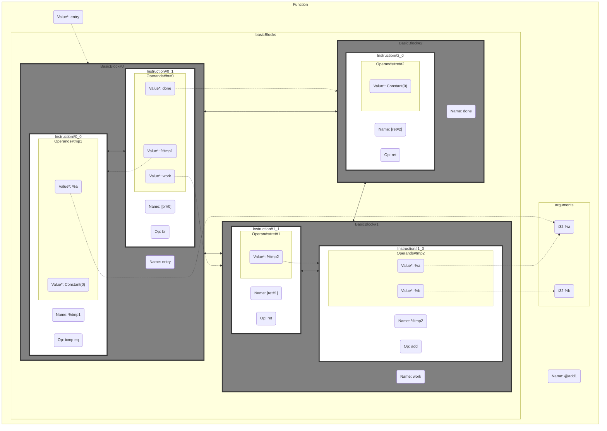

## 概括

以 Clang 为例，高级语言代码在经历前端的 `Lexer` `Parser` `Sema` 等组件处理后转换为 AST 抽象语法树，AST 再经过 CodeGen 组件生成 LLVM IR，交由 LLVM 后端处理

LLVM 本体大致有 IR(中间表示)、Pass(?不知道咋翻译)、Target(目标平台代码生成) 这几个主要组件

IR 为 LLVM 内使用的通用中间表示，IR 是个“轻量、足够低级但富有表达性、有类型、可扩展的”语言(起码它是这样说的)，对人尽量可读，对机器也能能方便地进行操作

Pass 则是 LLVM 内最具有特色的组件，各种 Pass 则对 IR 进行分析、转换，完成代码优化、内建特性(Intrinsic)实现等功能，也提供向对应 平台相关IR(MIR) 转换的功能；

最后的 Target 组件则负责从 IR 生成对应平台的汇编或机器代码

## 组件

### ADT 

```she
LLVM-PROJECT/llvm/include/llvm/ADT/
LLVM-PROJECT/llvm/lib/Support/
```

各种抽象数据结构/容器，你们 C艹 人是真喜欢造轮子

#### class `SmallVector` / `SmallString`

一是尝试(也可以回退)使用 `uint32_t` 来存储长度而非 `std::size_t` 来节省空间，二是对于 `SmallVector<T,N>` ，尝试直接内联 `N*sizeof(T)` 的空间进入类型中来避免少于 N 个元素时的堆开销

#### class `Twine`

使用二叉树结构来描述字符串临时的拼接，避免 string 的堆开销。如 `auto c = Twine(std::string(a), "b")`，此时 c 的左子树保存 a 的常引用，右子树保存 "b" 的指针，再 `auto e = Twine(c, "d")` 则 e 的左子树保存 c 的常引用；此时调用 `e.str()` 则会从保存的二叉结构构造完整字符串

这个类**不会延长**保存的元素的**生命周期**，特别是临时变量用完就扔在其中是完全不能存在的，必须在确定作用域的情况下使用，多少有点为性能的受虐狂情结

#### class `ilist_node`

侵入式双向链表的基础节点。如 `ClassA : public ilist_node<ClassA, Tag1>` 这种类声明，即在 `ClassA` 内部放置了对应 Tag1 的双向链表指针，使用 `simple_ilist<ClassA, Tag1> list` 即可往 `list` 中插入 `ClassA` 对象，当一个对象需要插入至不同链表中时，多重继承不同的 Tag 的 `ilist_node` 模板，同上链表也使用对应的 Tag。需要**注意**元素对象的**生命周期**问题，`simple_ilist` 不负责管理容器中元素的生命周期，要实现比较复杂的生命周期管理需要在链表插入/删除元素等操作时使用 `iplist_impl` 包装类指定回调函数来实现

#### class `APInt` / `APFloat`

任意位宽的 Int/Float，但不是如 Python 那样的自动大整数扩展，而是手动设定位宽，不同位宽之间的数据无法进行运算，必须进行扩展或者截断

作为有符号整型时， `APInt` 最高位为符号位，其余位存储对应数值绝对值的原码

### IR

```shell
LLVM-PROJECT/llvm/include/llvm/IR/
LLVM-PROJECT/lib/IR/
```

LLVM IR 假定有无限多任意大的寄存器可用，所以**看上去像**个高级语言一样有着 `变量名N = 运算I 类型名T 参数P1 参数P2` 一样的语法，实际上:

- 在 LLVM 虚拟机中是声明了一个有着 `sizeof(T)` 大小，名字是 `N` 的寄存器，其中的数据是 `I P1 P2` 的结果
- 在 IR 结构中将 `I T P1 P2` 这个指令及其操作数起了个 `N` 的别名，之后做详细解释

IR 中可以包含丰富的 元数据(`Metadata`) 和 属性(`Attribute`)，用于描述高级语言中对底层实现指定的某些信息

一个编译单元的 IR 被放置于一个对应的 `Module` 中，一个 `Module` 包含了该单元内的所有全局变量、函数、符号等，也包含了对应的平台信息。而类型、编译选项等能跨编译单元的信息则被放入 `LLVMContext` 中

#### class `Type`

IR 类型系统中所有类型的基类。需要理解的是，这是一个描述具体类型的类型系统，如 `IntegerType` 这个**类**可以实例化出 ` i8 u32` 等具体的类型的**对象**。也正是因为这个道理，一个具体的类型被实例化后就不可更改、不可销毁，也不存在第二份同样的对象

#### class `Value`

IR 中的 `Value` 是所有参与运算的元素如全局变量、常量、函数等的元素的基类，一个 `Value` 对象有其对应的类型(`Type` 类实例化后的对象)，注意，这个 `Value` **并非**字面意思的表示一个具体的**值**(虽然也可以)

#### class `User : Value` / `Use`

IR 中的 `User` 是指令和函数等使用 `Value` 的类的基类，同时，一个`Value` 对象会记录着所有使用它的 `User` 对象的指针，`User` 一般也是以引用或指针形式存在

`Use` 则用于表示 使用—被使用 这一条边的关系，也是一个链表元素，可以串起来

比较恶心的是 LLVM 项目中，`User` 作为基类及后面的 `Instruction` 子类等并没有用于记录自己使用的 `Value` 的成员变量，而是通过魔改 `User::operator new` 在每次对象被 `new` 出来时额外在前方开辟一块空间用于放 `Use` 数组，再通过静态成员函数接受 `this` 指针并计算偏移量获取存放的 `Use` 对象，靠这样来记录使用关系。~~他妈的是真恶心，模板加宏，看到中风，性能受虐情结尤为突出，搞个虚继承不行吗~~

#### class `Instruction : User`

`Instruction` 是 IR 中所有指令的基类，不同的指令派生出不同的子类，使用 `Value::SubclassID` 表示不同的 `Opcode`。一个 `Instruction` 对象代表了 IR 中的一条指令，写出来就是 `%res = Op Type %p1 %p2 %p3`，其中，`Op` 是 `Instruction` 的操作符名(`OpcodeName`)，注意不是这个 `Instruction::Value` 的 `Name`，这个 `Name` 即它的名字是 `%res`，这个对象同时靠 `Use` 记录着所有操作数的指针

`Instruction` 同时是 `ilist_node` 的子类，用于存储及顺序表示多条指令，管理其的容器为 `BasicBlock`，可通过 `.getParent()` 获取之

#### class `Constant : User`

这玩意继承自 `User` 主要是因为这玩意可能是常量数组、结构体和函数等

全局变量 `GlobalValue` 也属于 `Constant`，此时 `Constant` 的是其在程序中的地址，在整个程序中不可变

#### class `BasicBlock : Value`

一个 `BasicBlock` 代表 LLVM IR 程序结构中一串 *连续* 的指令，这里的连续指的是一连串 非终结(non-terminating) 指令紧跟着一条 终结 指令构成的指令块。诸如分支判断、函数调用、异常处理等指令为终结指令。这也挺好理解，终结指令则改变了执行流，分出其他的 `BasicBlock`

`BasicBlock` 的类型为 `LabelTy`，与汇编中见到的 lable 意思差不多

`BasicBlock` 同时也是 `ilist_node` 的子类，管理其的容器为 `Function`，可通过 `.getParent()` 获取之

#### class `Function : ... : GlobalValue`

一个 `Function` 就是一个函数，包含其属性表、函数参数、还有用到的所有 `BasicBlock`

`Function` 属于 `GlobalValue` 和 `Constant`，因为其在程序中的地址也是写死的，也是全局可见的，C++ 中的 lambda 函数看似是局部的，实际真正执行的函数是加了一堆命名空间的匿名对象中的 `operator()()`，同样也是全局的

`Function` 是 LLVM Pass 最常处理的单元

#### 图图

并不是真实的类继承图，仅为结构展示，特别是其中写的数组可能实际上是链表



对于下面这个 IR 表示，对应的结构大概是这样

```assembly
define i32 @add1(i32 %a, i32 %b) {
entry:
  %tmp1 = icmp eq i32 %a, 0
  br i1 %tmp1, label %done, label %work
  
work:
  %tmp2 = add i32 %a, %b
  ret i32 %tmp2
  
done:
  ret i32 0
}
```



