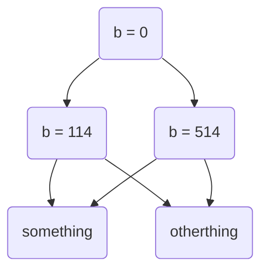
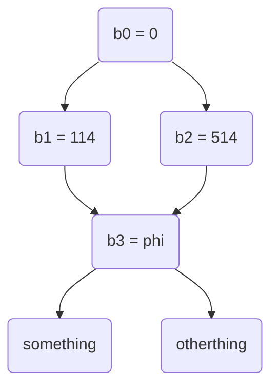
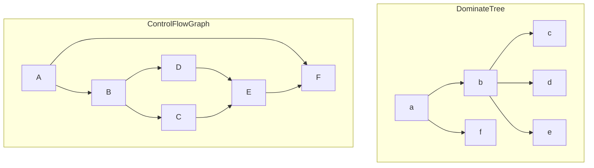

在快进到看 Pass 前，得先了解一下一些简单的描述程序的数据结构和算法

#### SSA 静态单赋值形式 / Phi Φ函数

在 IR 中，为了方便后续的分析及简化表述，一个寄存器只能在一个固定的地方被赋值一次，这种赋值形式被称为静态单赋值形式。这种方式极大的简化了对 使用-定义(UD) 链的分析，因为，进而为常量折叠、死码消除等功能提供方便

然而不幸的是在一个高级语言中，重复对一个变量进行赋值是件很常见甚至是必要的操作，如下述 C 语言程序中的变量 b：

```c
int b = 0;
if(a > 114)
    b = 514;
else
    b = 1919;
something(b);
otherthing(b+1);
```

为了使这段程序变成 SSA 形式，一个简单而暴力的方法就是先掩耳盗铃给每个出现的 b 命名为其他的名字：

```c
int b0 = 0;
if(a > 1919)
    int b1 = 114;
else
    int b2 = 514;
something(b3);
otherthing(b3+1);
```

好了，这下所有变量都只出现过一次赋值了，问题是这个 b3 变量的定义咋搞，这时候得再作一次弊，引入一个叫 Φ函数 的玩意，用来表示执行流分叉后给变量带来的后果：

```c
int b0 = 0;
if(a > 1919)
branch1:
    int b1 = 114;
else
branch2:
    int b2 = 514;
int b3 = phi([b1, branch1], [b2, branch2]);
something(b3);
otherthing(b3+1);
```

这里的 `phi([b1, branch1], [b2, branch2])` 表示如果执行流从上方的 `branch1` 来的就返回 `b1` 的值，`branch2` 来的就返回 `b2` 的值。通过两次看起来徒增复杂度的操作，我们成功实现了 SSA，那么好处在哪儿呢？考虑原程序的 UD 链：



再看看 SSA 形式的 UD 链：



可以看到，对分支两边对 `b` 赋值的使用量减少了，对 `something` 和 `otherthing` 引用的定义量也减少了，这么一来或许在实际复杂度上没有改变，但对编译器代码的编写可节省了不少功夫

#### ControlFlowGraph 控制流图 

一个 控制流图(简称CFG) 就是若干个 `BasicBlock` 作为节点相互连接构成的 有向图(DirectedGraph)，并存在 起始节点 和 终止节点 两个特殊节点，一个节点的 出度(outdegree) 或 入度(indegree) 必定大于 1，其于诸多属性如 强连通分量 等跟图论中的没有区别

控制流图中的分叉意味着程序中的条件分支，当控制流图中存在环时意味着存在循环，当有节点不存在入边时就可视为死码(当然起始节点不算)

#### Dominate 支配 / Dominator Tree 支配树 / Dominance Frontier 支配边缘

在 CFG 中，如果从起始节点出发**要抵达 M节点 必须经过 N节点**，则称 N **支配**(dominate/dom) 了 M；**当 `N dom M` 且 `N != M` 时**，N **真支配**(strictly/sdom) 了 M；**当 `N sdom M` 且不存在 `N'` 使 `N sdom N', N' sdom M` 时**，称 N **直接支配**(immediate dominate/idom) M，说人话就是 M节点 的直接父节点是 N节点

由**直接支配**关系构成的图称为 **支配树**(Dominator Tree)



对于一个节点 D，当 D 能支配 N_i 的任意一个前驱节点(注意可以是 D 本身)且 D 并不直接支配 N_i 时，这些 N_i 的集合称为节点 D 的**支配边缘**(dominace frontier)，写出来即是 `DF(D) = {N | D dom pred(N) AND !(D sdom W)}`，说人话就是 D 节点单凭自己可以影响到的边界，这个边界的节点及后继节点均受更多 D​ 之外的节点影响

如上面 CFG 图中节点的支配边缘为：

| Node  | A    | B    | C    | D    | E    | F    |
| ----- | ---- | ---- | ---- | ---- | ---- | ---- |
| DF(N) | {}   | {F}  | {E}  | {E}  | {F}  | {}   |

以节点 C 举例，`C dom ( pred(E) -> C ), C !sdom E`，说人话 C 只能影响自己，边界到 E

#### 说得好，但支配跟 SSA 有什么关系

CFG 中的分支意味着程序的条件跳转，而支配边缘决定了一处变量赋值带来的影响能不受干扰走多远，结合这两者，不难联想到变量的传播。对于一处变量的赋值，这个变量的值不会改变直到抵达了这个赋值的支配边缘，在这个边缘上，有更多对该变量的赋值参与了进来，正是插入 phi函数 的好时机。正式的程序就是如此：

```python
def placePhis(program):
    variables = collect_variables(program)
    defsites = [i.get_definition_site() for i in variables] # 获取所有变量的定义位置
    for defsite in defsites:	# 对每个定义位置
        for node in DominanceFrontier(defsite) # 寻找该定义的支配边缘，即单个变量不同定义汇聚的位置
        	if containsPhi(node) == False:	# 如果这个支配边缘没有 phi函数
                insertPhi(node)	# 插入 phi函数
                defsites.append(node) # phi函数是一个新的定义，加入定义位置列表中
```

实际上就是在计算 **Iterated Dominance Frontier**(遍历后支配边缘？没找到好的翻译)

结合简单的变量重命名，我们就能实现程序的 SSA 辣！

#### 偷鸡及附注

以上对于 SSA 的讨论，都是在高级语言的变量上进行的，在 LLVM IR 层面对应的则是寄存器。如果要在 LLVM IR 之上写一门高级语言的编译器，除了通过构造 SSA 方法外，更简单的方案是利用 栈内存，把寄存器操作化为栈内存的读写，可以参考 [plan b](https://buaa-se-compiling.github.io/miniSysY-tutorial/pre/llvm_ir_ssa.html)

这一段内容略微超出了 LLVM 代码本身的层面，绝大多数内容离不开以下资料的帮助

[LLVM-Study-Notes](https://llvm-study-notes.readthedocs.io/en/latest/ssa/SSA-Construction.html#:~:text=%E7%9B%B4%E6%8E%A5%E6%94%AF%E9%85%8D%E8%8A%82%E7%82%B9-,Dominance%20Frontier,-%EF%83%81)

[Wikipedia:Dominator](https://en.wikipedia.org/wiki/Dominator_(graph_theory))