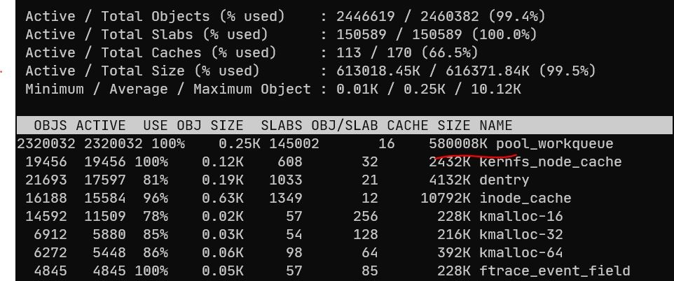
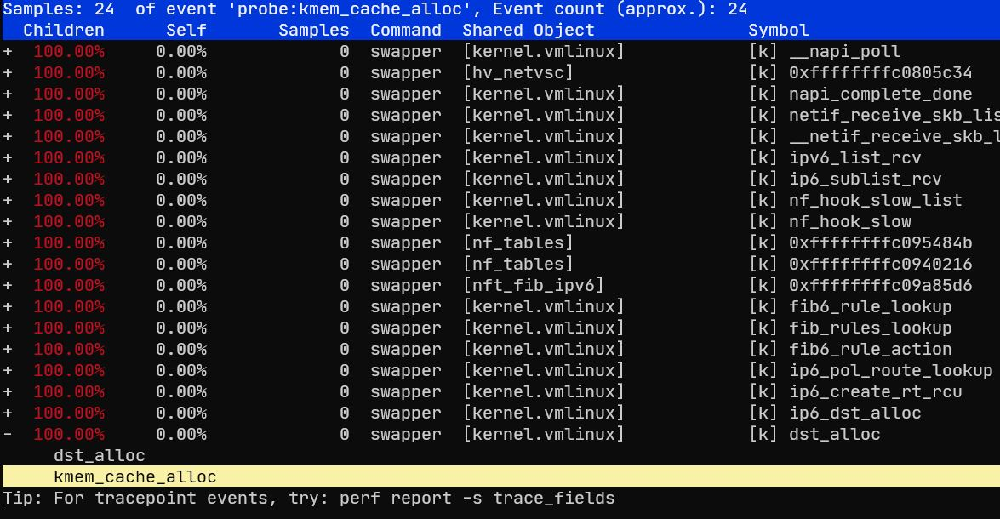
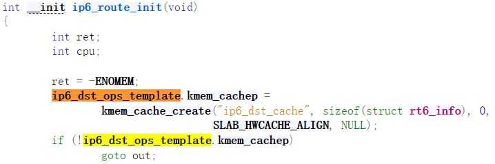
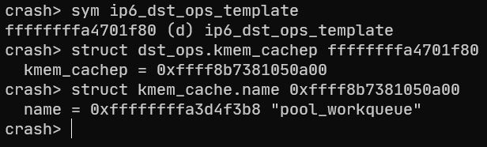
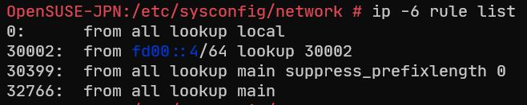

> ~~航空发动机~~ Linux 内核的构成极其复杂，部件之间的相互作用和影响广泛，由于缺乏完整的机理和模型库，无法准确对故障进行定位，演绎和推理。本文针对 Linux 内核内存泄露诊断应用需求实际，结合传统中医理论中的整体观念，动态辩证观以及经验积累的方法，抽象出新的方法论，利用中医诊断理论的思维方式，……

## 1. “天人合一”的整体观念

事发源于笔者运行着 OpenSUSE 15.5 的 Azure B1s 实例，笔者观察到，当服务器运行一段时间后，往往会出现响应极度迟缓甚至无响应的情况，只能进行硬重启。笔者的初步排查确定为内存泄露，但由于 Azure B1s 给的 IO 资源非常滴珍贵，有**足足的** 23 MBps，意味着只要有高频资源往 swap 里写这系统就基本没救了，所以一直未能于漏得严重时进行排查。由于笔者其他同系统相近配置的服务器均未出现这种状况且其他诸多在 Azure 上的不愉快体验，笔者已经在心中给 Azure 的麻麻飞了不知道多少次，于是形成了 Azure 麻麻在天上的“天人合一”的整体观念

## 2. “阴阳五行”的动态辩证关系

经笔者观察发现，当该实例网络流量较小时，该实例往往能活得比较久，而当流量较大特别是 IPv6 流量较大时，该实例很快就会吃满内存。IPv6 是未来网络的主要承载者，是朝阳技术，故笔者怀疑是 IPv6 流量带出了实例的阳气，导致该实例阴盛阳虚，内存泄露。同时五行相生相克，亦如 Linux 内核与其上运行的软件，内核 panic 了谁也别想活着，其上运行的软件死了内核活着也没啥意思，比如 OOM 到给笔者的 sshd kill 了。于是笔者从上到下重点关照参与网络活动的组件

## 3. “神农氏尝百草式”的经验积累

笔者对使用网络的诸多进程挨个杀了一遍，仍然存在内存泄露问题，所以大致可以得出百草是没啥问题的经验积累，是这块地有问题，于是笔者使用了 `slabtop` 指令去检查了内核内存占用：



如上图，可以发现 `pool_workqueue` 这玩意要上天了，笔者对其进行了更进一步的实验，当实例向 IPv4 地址或 IPv6 回环地址发送数据时，`pool_workqueue` 没有增加 objects，而向其他 IPv6 地址发送数据时，可稳定观测到 objects 的增加

经过初步的搜索，笔者发现这 `pool_workqueue` 管的是内核的工作队列，workqueue.c 里半点网络的东西没有，笔者最初怀疑是网络操作伴随了的工作创建，于是使用了 perf 试图追出是哪个函数分配了这些对象

```shell
perf probe --add 'kmem_cache_alloc s->name:string'
perf probe --add 'kmem_cache_free s->name:string'
perf record -e 'probe:kmem_cache_alloc,probe:kmem_cache_free' --filter 'name == "pool_workqueue"' -aRgvv
```



笔者开始怀疑起了人生，`ip6_dst_alloc` 很明显不会创建什么工作，然而还是搁 `pool_workqueue` 里创建了对象

进一步阅读代码发现，`ip6_dst_alloc` 会使用传入 `net` 对象中 `ipv.ip6_dst_ops` 内的 `kmem_cachep` 所指的 slab cache 分配自身的对象，而这里面的 `ip6_dst_ops` 来源于一个模板对象，欧剋，那也就是说只要找到模板对象里的 `kmeme_cachep` 是什么就能确定实际用的 slab cache 是哪个：



然后笔者在实例上使用 crash 也看了一次



笔者一度陷入了严重的自我怀疑，好在当笔者执行 `slabtop -o | grep ip6_dst_cache`  试图看看 `ip6_dst_cache` 真的占用多少时，发现 slabtop 给出的结果里根本没这项。后续笔者搜索到的文档表明，内核会将对象大小相似的 slab cache 进行合并，而笔者这里很不巧的遇到了 `ip6_dst_cache` 合并至 `pool_workqueue` 内

## 4. 内存泄露研究

对 `ip6_dst_cache memory leak` 进行搜索便很快能找到一个 21 年的 [bug report](https://lore.kernel.org/netdev/e022d597-302d-c061-0830-6ed20aa61e56@qtmlabs.xyz/)，经过比对笔者可以确定遇到的是同样的问题，触发这个内存泄露需要同时：

- nftables 里存在对 IPv6 的 fib 规则
- IPv6 路由规则里设置了 `suppress_prefix` 的项目

这是由于内核函数 `fib_rules_lookup()` 在查询 fib 规则时，如果存在 `suppress_prefix` 的配置，会调用函数 `fib6_rule_suppress()`，而传入的 `fib_lookup_arg *arg` 内的 `flag` 成员设置的是默认通用的 `FIB_LOOKUP_NOREF`，[存在缺陷的逻辑](https://github.com/torvalds/linux/blob/ca7a03c4175366a92cee0ccc4fec0038c3266e26/net/ipv6/fib6_rules.c#L289)会阻止对 `struct rt6_info.dst` 引用计数的释放，[正确逻辑](https://github.com/torvalds/linux/blob/4d145e3f830ba2c2745b42bfba5c2f8fcb8d078a/include/net/ip6_route.h#L99)应该考虑 IPv6 路由规则查询参数特有的 flag 如 `RT6_LOOKUP_F_DST_NOREF`  来考虑是否释放引用计数，最终导致引用计数不能正确减少而内存泄露

很不幸的是，以上两个触发条件并不难达成：

- firewalld 会给 nftables 设置 IPv6 的 fib 规则，这似乎是在判断流量来源是否是个可达的 IPv6 地址来 drop 掉伪造地址的恶意流量
- cloud-netconfig 会默认追加一个 `from all lookup main suppress_prefixlength 0` 的路由规则，这会使路由内网地址时不走 main 路由表，这应该是无害的，因为在这之前 cloud-netconfig 应该也已经配置好了内网的路由
  

在笔者其他的机子上由于并没有 Azure 带来的一整套起夜级 cloud-init 方案，侥幸地躲过了问题配置

## 5. 基于中医理论的解决方案

- 重新编译一份 patch 好的内核，虽然[修改的内容](https://git.kernel.org/pub/scm/linux/kernel/git/stable/linux.git/commit/?id=209d35ee34e25f9668c404350a1c86d914c54ffa)不多但改变了部分函数签名，笔者比较怀疑会有兼容问题，没试
- 给 firewalld 或者 firewalld 设置的 fib 规则扬了
- 移除上述的路由规则，可以使用 `ip -6 rule del from all lookup main suppress_prefixlength 0` 给它临时扬掉然和等着 cloud-netconfig 给它加回来。笔者选择了给 cloud-netconfig 这部分的代码给注释掉，大致位于 `/usr/lib/cloud-netconfig/cloud-netconfig:383`，由于路由优先级的存在这样扬掉应该也问题不大

笔者实测搞定后服务器腰也不疼了气也不喘了整个机子都精神了

## 6. 参考文献

1. [[基于中医诊治理论的航空发动机故障诊断新技术初探](https://www.zhangqiaokeyan.com/academic-conference-cn_meeting-39276_thesis/020222424766.html)](https://xueshu.baidu.com/usercenter/paper/show?paperid=1w4700y0ae1y0ej0625n0ev042493056)
2. [ipv6: fix memory leak in fib6_rule_suppress](https://git.kernel.org/pub/scm/linux/kernel/git/stable/linux.git/commit/?id=209d35ee34e25f9668c404350a1c86d914c54ffa)
3. [Slab Merging 特性](http://raverstern.site/en/posts/slab-merging/)
4. [slub合并查询表](https://blog.csdn.net/py199122/article/details/120484086)
5. [Forwarding information base : Ingress filtering against denial of service](https://en.wikipedia.org/wiki/Forwarding_information_base#Ingress_filtering_against_denial_of_service)
